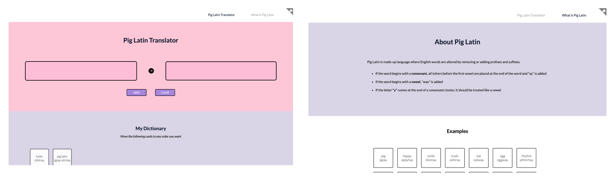

# Pig Latin Translator App

> An SPA Translator that converts English to Pig Latin built with React.js

## Table of contents

- [General info](#general-info)
- [Screenshots](#screenshots)
- [Technologies](#technologies)
- [Demo](#demo)
- [Setup](#setup)
- [Scope of Functionalities](#scope-of-functionalities)
- [Project Status](#project-status)
- [Inspiration and Sources](#inspiration-and-sources)
- [Contact](#contact)

## General info

Pig Latin Translator App is a continued project from my past project, [Pig Latin Translator with Python](https://github.com/danakim21/pig-latin-translator). The website contains a Pig Latin translator, dictionary, and descriptions on Pig Latin.

### Pig Latin Rules

- If the word begins with a consonant, all letters before the first vowel are placed at the end of the word and "ay" is added
  - "pig" = "igpay"
  - "happy" = "appyhay"
  - "smile" = "ilesmay"
  - "trash" = "ashtray"
- If the word begins with a vowel, "way" is added
  - "eat" = "eatway"
  - "egg" = "eggway"
- If the letter "y" comes at the end of a consonant cluster, it should be treated like a vowel
  - "rhythm" = "ythmrhay"

#### When is "Y" a vowel or consonant

- [Reference](https://www.merriam-webster.com/words-at-play/why-y-is-sometimes-a-vowel-usage#:~:text=Y%20is%20considered%20to%20be,%2C%20deny%2C%20bicycle%2C%20acrylic.)
- Y is considered to be a vowel if
  - There is no other vowel (ex. gym, my)
  - The letter is at the end of a word or syllable (ex. candy, deny, bicycle, acrylic)
  - The letter is in the middle of a syllable (ex. system, borborygmus)

## Screenshots



## Technologies

Languages, Libraries, Versions (ex. Python 2.7)

- React.js
- [muuri-react](https://github.com/Paol-imi/muuri-react) package
- [react-github-corner](https://github.com/skratchdot/react-github-corner) package

## Demo

Here is a working live demo: [link](https://danakim21.github.io/pig-latin-translator-app/#/)

## Setup

```
# Clone this repository
$ git clone https://github.com/danakim21/pig-latin-translator-app.git

# Go into the repository
$ cd pig-latin-translator-app

# Install dependencies
$ npm install

# Run the app and access it at localhost:3000
$ npm start
```

## Scope of Functionalities

List of features ready

- Converts any word or sentences to Pig Latin
- Save word set to my dictionary -- Cards are placed in created date
- Save my dictionary to local storage -- Words still exist if page is reloaded
- Move different set of cards as the user wants

To Do

- Delete cards from my dictionary
- Make cards size fit to word length
- Add tags and filter features for cards
- Make it responsive

## Project Status

Project is: _in progress_

## Inspiration and Sources

- Color scheme inspired by [happy hues](https://www.happyhues.co/palettes/7)

## Contact

Created by [@danakim21](https://danakim21.github.io/) - feel free to contact me!
